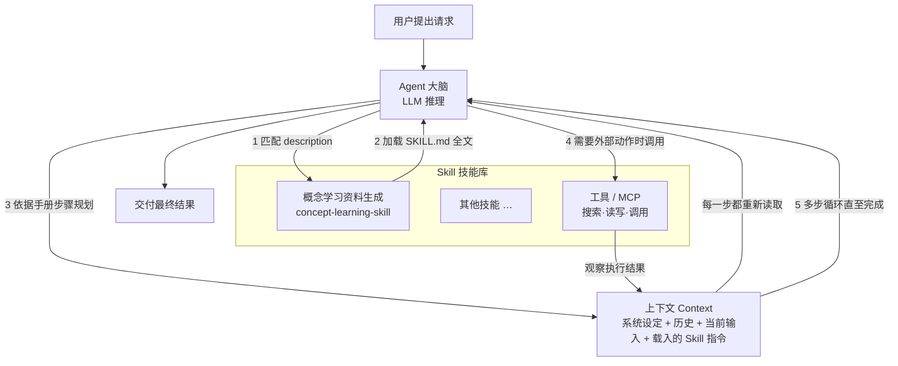
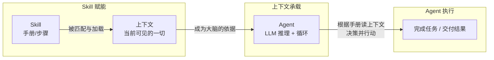

# Agent · 上下文 · Skill 三者关系图

> 本文档配合 `learning-materials/` 下的三份概念资料（`concept_agent.html`、`concept_llm_context.html`、`concept_skill.html`）阅读，
> 用 **Mermaid 流程图 + 文字** 交叉说明：一个 Agent 如何借助"上下文"和"Skill"真正"干成事"。
> 生成工具：`concept-learning-skill` · 核验日期：2026-09-08

---

## 一、一张图看懂：Skill 如何驱动一个 Agent 跑起来

下面这张 Mermaid 时序流展示一个典型运行闭环。核心一句话：
> **Agent 是"会干活的人"，Skill 是"干活用的操作手册"，上下文是"干活时摊在桌上的资料"——人靠手册、看着桌上的资料，一步步把活干完。**

### 图怎么读（关键节点说明）
| 节点 | 它是什么 | 在闭环里的作用 |
|------|---------|--------------|
| **Agent 大脑** | 负责推理的大模型 | 读手册、定步骤、做判断、发行动指令 |
| **Skill 技能库** | 一叠"操作手册"（SKILL.md） | 命中后给 Agent 提供"这事该怎么做"的 SOP |
| **上下文 Context** | 本轮全部可见文字（含已载入的手册、历史、观察结果） | 供 Agent 每一步"重读"的依据，决定它当下能看到什么 |
| **工具 / MCP** | 能碰外部世界的接口 | 把"想"变成"做"，再把结果回填进上下文 |

---

## 二、逐个理清各自的定位

### 1. Agent —— 主角：会干活的人
- 提供**主动性 + 循环**：规划 → 行动 → 观察 → 再决策，直到任务完成。
- **没有它，Skill 和上下文只是"躺在文件里的文字"**，无人去读、去执行。
- 类比：一位有自主性的助理。

### 2. 上下文 Context —— 舞台：当前摊在桌上的资料
- 是 Agent **每一轮真正"看得见并依赖"的全部文字**（系统设定 + 对话历史 + 当前输入 + 被载入的 Skill 指令 + 工具观察结果）。
- 有**容量上限（token 窗口）**，放不进的内容 Agent 看不见。
- 类比：助理桌上那张"只能摆这么多文件"的桌面。

### 3. Skill —— 剧本：一份可复用的操作手册
- 通过 `description` 被 Agent **自动匹配唤醒**，命中后把 `SKILL.md` 全文载入上下文。
- 提供"这类任务**该按什么步骤做**"，让产出**稳定、可复用、可共享**。
- 类比：助理文件夹里"遇到这类活就翻这本照做"的 SOP 手册。

---

## 三、三者关系：谁依赖谁

### 依赖关系文字版
1. **Skill → 上下文**：Skill 不会自己"生效"，它必须**被加载进上下文**才会影响 Agent 的输出。所以 Skill 本质上是"一段可复用、可触发的上下文模板"。
2. **上下文 → Agent**：Agent 的能力发挥**受限于上下文里有什么**——塞得进、塞得准，它才能答得对。超出窗口的内容它对不见、用不了。
3. **Agent → Skill（反向触发）**：Agent 是**执行者**，负责在正确时机匹配并调用 Skill，把手册变成实际行动。

> ⚠️ **易混提醒**：Skill 和上下文都"住在文字里"，但角色不同——**Skill 是'怎么做'的流程规范，上下文是'此刻能看到什么'的工作台**。Skill 决定"该用什么姿势干活"，上下文决定"眼下手上有没有料"。

---

## 四、一个串联三者的最小例子

> 需求：用 Agent 生成一份「哈希表」的学习资料。

| 阶段 | 发生了什么 | 涉及 |
|------|-----------|------|
| 触发 | 用户说"帮我学习哈希表" | Agent + Skill（description 命中 concept-learning-skill） |
| 加载 | 把 `concept-learning-skill/SKILL.md` 全文读入上下文 | Skill → 上下文 |
| 规划 | Agent 照手册的"六段式 SOP"分解任务 | Agent 读上下文中的手册 |
| 执行 | 逐节生成：个人解释/机制/应用/辨析/来源/自测；必要时检索资料并把结果放回上下文 | Agent + 上下文（+ 工具） |
| 交付 | 输出一份结构化《概念学习资料》 | Agent |

**结论**：同一套 Agent，只要换了上下文里的 Skill，就能"变身"去干另一类专业活——这就是 **Skill 决定能力方向、上下文决定能力上限、Agent 负责把能力跑出来** 的关系。

---

## 五、一句话总结

> **Agent 是引擎，Skill 是方向盘和驾驶手册，上下文是仪表盘与当前路况信息；引擎照着手册、盯着仪表，一步步把车开到终点。**
> Skill 让 Agent "会做什么"，上下文让 Agent "当下能看到什么"，两者共同决定了 Agent 实际表现的上限。
